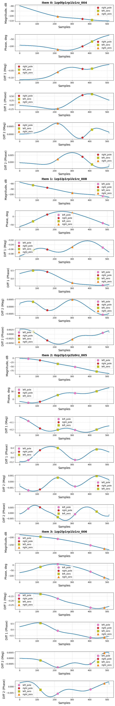

# Генератор датасета

## Структура датасета
```
project/
├── dataset/
│   └── train/
│       └── 0zp0lp0rp0lz0rz_000.csv
│       └── 0zp0lp0rp0lz0rz_001.csv
│       └── ...
│   └── train_masks.json
│   └── val/
│       └── 0zp0lp0rp0lz0rz_000.csv
│       └── 0zp0lp0rp0lz0rz_001.csv
│       └── ...
│   └── val_masks.json
│   └── test/
│       └── 0zp0lp0rp0lz0rz_000.csv
│       └── 0zp0lp0rp0lz0rz_001.csv
│       └── ...
│   └── test_masks.json
```

## Конфигурирование

[config.json](config/config.json)

"split": "train", "val", "test"

nzp_nlp_nrp_nlz_nrz_000.csv


## Запуск на генерацию

Запуск генерации датасета через [main.py](utils/main.py).

```
python src/main.py
```

## Даталоудер

 [ZerosPolesDataset.py](utils/ZerosPolesDataset.py).

Пример использования даталоудера представлен в [debug_notebook.ipynb](debug_notebook.ipynb).

<p align="center" width="100%">
  
</p>