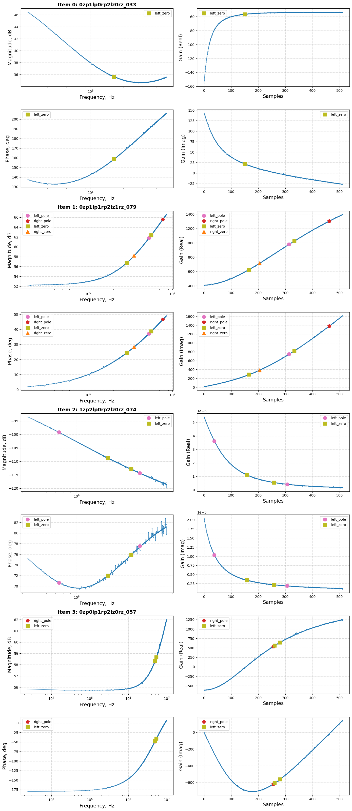

# Генератор датасета

Реализован генератор csv-таблиц частотных характеристик со столбцами:
- Frequency (Hz),
- Gain (dB),
- Phase (deg).

Модель обобщенного линейного звена:

$$\begin{equation}
    H(s) = G \frac{\prod\limits_{m=1}^{M} \left(1 + \frac{s}{\omega_{z(m)}} \right)}{s^K \prod\limits_{n=1}^{N} \left(1 + \frac{s}{\omega_{p(n)}}\right)} e^{-s t_\text{delay}},
\end{equation}$$

где
- ${G}$ - пропорциональный коэффициент,
- ${t_\text{delay}}$ - задержка времени (${t_\text{delay}>0}$),
- ${K}$ - количество интеграторов,
- ${\omega_{z(m)} \in \{\omega_{z(1)}, \omega_{z(2)}, ..., \omega_{z(M)}\}}$ - частоты нулей передаточной функции ${H(s)}$ в количестве ${M}$,
- ${\omega_{p(n)} \in \{\omega_{p(1)}, \omega_{p(2)}, ..., \omega_{p(N)}\}}$ - частоты полюсов передаточной функции ${H(s)}$ в количестве ${N}$.

В [general_functions.py](utils/general_functions.py) представлены функции:
- `transfer_function` - вычисление массива комплексного коэффициента передачи,
- `generate_masks` - генерация int-координат нулей и полюсов,
- `calculate_freq_zeros_poles` - преобразование int-координат нулей/полюсов в частоты для использования в `transfer_function`.

## Конфигурирование

Параметры генерации задаются в [config.json](config/config.json):

- `split`: `str` - `train`, `val`, `test`.
- `size`: `int` - количество генерируемых данных на каждый набор нулей/полюсов.
- `clearance_width`: `int` - минимальное расстояние между ближайшими объектами одного типа, а также от краев диапазона частот.
- `seed`: `int` или `null`.
- `length`: `int` - длина массива.
- `fmin`: `[float, float]` - диапазон для нижней границы частот.
- `fmax`: `[float, float]` - диапазон для верхней границы частот.
- `gain`: `[float, float]` - диапазон для пропорционального коэффициента. Должно выполняться `gain`>0, т.к. конвертируется в дБ.
- `phase_delay`: `[float, float]` - диапазон для фазового запаздывания (рад.) на частоте `fmax`.
- `noise_level`: `[float, float]` - диапазон масштабирующего коэффициента (уровня) генератора шумов.
- `noise_reduce`: `int` - коэффициент прореживания генерируемого шума.
- `Nzp_max`: `int` - максимальное количество интеграторов.
- `Nlp_max`: `int` - максимальное количество полюсов левых.
- `Nrp_max`: `int` - максимальное количество полюсов правых.
- `Nlz_max`: `int` - максимальное количество нулей левых.
- `Nrz_max`: `int` - максимальное количество нулей правых.

## Структура датасета

Каждой конфигурации `[Nzp, Nlp, Nrp, Nlz, Nrz]` соответствуют `size`- элементов с разным расположением нулей/полюсов и разным диапазоном частот. Количество интеграторов (`nzp`), полюсов (`nlp`, `nrp`) и нулей (`nlz`, `nrz`) зашифровано в имени файла:

`nzp_nlp_nrp_nlz_nrz_xxx.csv`

где `xxx` - порядковый номер из `size`.

Например, `1zp_2lp_0rp_1lz_1rz_001.csv`:
- `zero_poles`: 1,
- `left_poles`: 2,
- `right_poles`: 0,
- `left_zeros`: 1,
- `right_zeros`: 1.
- `001` - номер примера такой конфигурации; всего из `size`-примеров.

```
project/
├── dataset/
│   └── train/
│       └── 0zp0lp0rp0lz0rz_000.csv
│       └── 0zp0lp0rp0lz0rz_001.csv
│       └── ...
│   └── train_masks.json
│   └── val/
│       └── 0zp0lp0rp0lz0rz_000.csv
│       └── 0zp0lp0rp0lz0rz_001.csv
│       └── ...
│   └── val_masks.json
│   └── test/
│       └── 0zp0lp0rp0lz0rz_000.csv
│       └── 0zp0lp0rp0lz0rz_001.csv
│       └── ...
│   └── test_masks.json
```

Маски агрегированы в json-файлы - по одному файлу на каждый `split`: `train`, `val`, `test`. Маски хранятся в виде целых чисел:
- `zero_poles`: `int` - количество интеграторов,
- `left_poles`: `List[int]` - координаты полюсов левых,
- `right_poles`: `List[int]` - координаты полюсов правых,
- `left_zeros`: `List[int]` - координаты нулей левых,
- `right_zeros`: `List[int]` - координаты нулей правых.

## Запуск на генерацию

Генерация датасета осуществляется через [main.py](main.py). При необходимости сгенерировать все 3 набора `split`: `str` - `train`, `val`, `test` необходимо последовательно задать в [config.json](config/config.json) соответствующие `split` и `size`; каждый раз выполнять

```
python src/main.py
```

## Даталоудер

Создан датакласс [ZerosPolesDataset.py](utils/ZerosPolesDataset.py), наследующий от `torch.utils.data.Dataset` следующие методы:
- `__init__`: инициализация путей к данным и маскам;
- `__len__`: возврат количества примеров в датасете;
- `__getitem__`: загрузка и возврат одного примера в виде `(data_tensor, masks_tensor, freq_tensor)`.

Каждый элемент представлен следующими объектами:
- `data_tensor` - тензор размера `[2, length]` - канал `Gain` и канал `Phase`,
- `masks_tensor` - тензор размера `[4, length]` - канал полюсов левых, канал полюсов правых, канал нулей левых, канал нулей правых. Каждая маска формируется функцией [positions_to_mask](utils/ZerosPolesDataset.py) - преобразование координат нулей/полюсов в бинарные маски - массивы длины `length`, содержащие `1` в координатах нулей/полюсов и `0` в остальных,
- `freq_tensor` - тензор размера `(length,)` - частоты; в обучении автоэнкодера не требуется.

### Аугментации

В методе `_augmentations_` датакласса [ZerosPolesDataset.py](utils/ZerosPolesDataset.py) реализованы следующие виды аугментаций:
- Умножение на константу.
- Фазовый сдвиг.
- Зашумление данных.

**Отключить: `transforms=None`**.

Параметры агментации задаются через `class TransformsConfig`:
- `gain`: `List[float]` - масштабирующий коэффициент; выбирается случайным образом из диапазона `[min, max]`. Недопустимо включать в диапазон отрицательные числа. **Отключить: `gain=[1.0, 1.0]`**.
- `phase_delay`: `List[float]` - фазовая задержка на масимальной частоте диапазона; выбирается случайным образом из диапазона `[min, max]>=0.0`. **Отключить: `phase_delay=[0.0, 0.0]`**.
- `noise_level`: `List[float]` - масштабирующй коэффициент шума; выбирается случайным образом из диапазона `[min, max]>=0.0` **Отключить: `noise_level=[0.0, 0.0]`**.
- `noise_reduce`: `int` - реализована возможность проредить шум `noise_reduce`-раз. **Отключить: `noise_reduce=0`**.

Пример использования даталоудера приведен в [debug_notebook.ipynb](debug_notebook.ipynb).

## Приложения
### Визуализация примеров (нет аугментации)

<p align="center" width="100%">
  
</p>

### Визуализация примеров (аугментации)

<p align="center" width="100%">
  
</p>